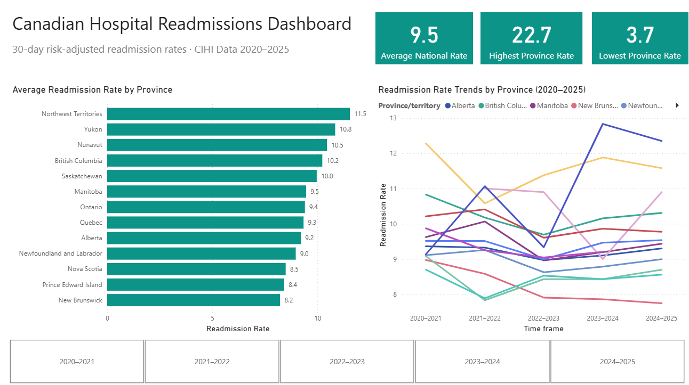
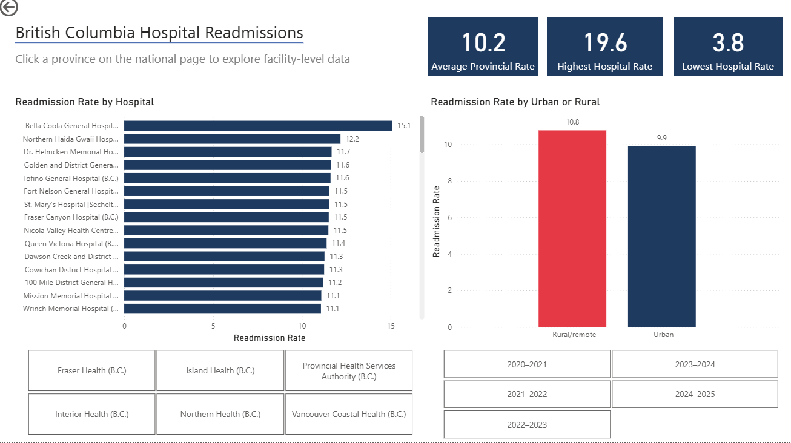

# Canadian Hospital Readmissions Analysis
30-day risk-adjusted readmission rates across Canadian provinces
Data from: CIHI Data 2020–2025

## Project Overview
This project analyzes hospital readmission rates across Canada using data from the 
Canadian Institute for Health Information (CIHI). It combines SQL analysis with an 
interactive Power BI dashboard to surface insights relevant to Canadian health authorities.

## Key Findings
Nationally:
- National average readmission rate is 9.5 per 100 patients
- Northern territories (NWT, Yukon) consistently have the highest rates
- New Brunswick is the top-performing province at 8.2

BC Specifically:
- BC rural hospitals average 10.8 vs 9.9 for urban — a persistent gap across all years
- Bella Coola General Hospital has the highest rate in BC at 15.1

## Tools Used
- SQL (DB Browser for SQLite)
- Power BI Desktop
- CIHI Open Data

## Dashboard Features
- National province comparison with interactive year slicer
- Drill-through from any province to facility-level data
- Dynamic titles that update based on selected province
- Urban vs rural comparison per province
- Health region slicer for facility filtering

## Data Source
Canadian Institute for Health Information (CIHI)
https://www.cihi.ca/en/indicators/all-patients-readmitted-to-hospital

## Screenshots

